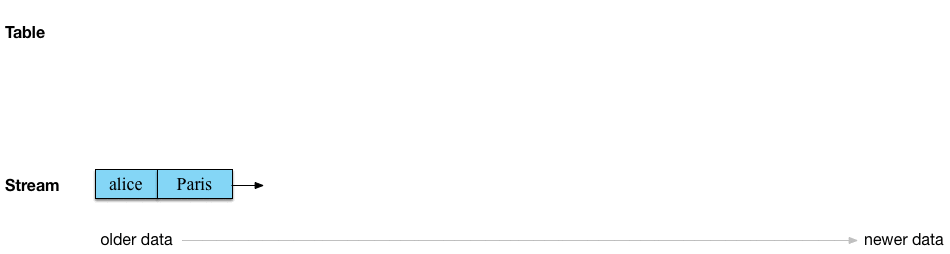

# Kafka Streams

Kafka Streams — это Java-библиотека для анализа и обработки данных, хранящихся в Apache Kafka. Как и в любой другой
платформе потоковой обработки, она способна выполнять обработку данных с сохранением и/или без сохранения состояния в
режиме реального времени.

Главная абстракция Kafka Streams – это поток – неограниченный и постоянно обновляемый набор данных в виде упорядоченной,
воспроизводимой и отказоустойчивой последовательности неизменяемых парных записей «ключ-значение» (key-value).
Вычислительная логика приложений потоковой обработки, использующих библиотеку Apache Kafka Streams, работает по графовой
модели обработчиков потоков (вершин), связанных между собой потоками (ребрами). В этой топологии обработчик является
узлом преобразования данных в потоки, который выполняет следующие действия [1]:

* получает по одной входной записи за раз от вышестоящих узлов;
* применяет к входящей записи свою операцию (агрегация, фильтр и пр.);
* создает одну или несколько выходных записей для своих нижестоящих узлов.

* Различают 3 вида обработчиков потоков Apache Kafka Streams:

* источник (source processor), который не имеет вышестоящих узлов, он создает входной поток в свою топологию из одному
  или нескольким топикам Кафка, потребляя из них записи и направляя их на свои нижестоящие узлы;
* обычный обработчик потока (stream processor), который получает входной поток от вышестоящих узлов, обрабатывает его и
  отправляет нижестоящим узлам, при этом обработанные результаты могут быть либо переданы обратно в Kafka, либо записаны
  во внешнюю систему;
* приемник (sink processor), который не имеет нижестоящих узлов, он отправляет все полученные записи от своих
  вышестоящих обработчиков в указанный топик Кафка.


В качестве логических единиц своей модели параллелизма Kafka Streams использует концепции потоковых разделов и потоковых
задач (stream task). При этом между Кафка и Kafka Streams существуют следующие связи:

* каждый потоковый раздел (stream partition) представляет собой полностью упорядоченную последовательность записей
  данных в соответствии с разделом топика (topic partition) Кафка;
* запись данных в потоке отображает сообщение из топика Кафка;
* ключи записей определяют разбиение данных по разделам (partition) в Кафка и Kafka Streams (то, как данные направляются
  в определенные разделы топиков).

Топология программного обработчика масштабируется путем разбивки его на несколько потоковых задач: Kafka Streams создает
фиксированное количество потоковых задач на основе входных потоковых разделов (stream partition) для приложения. При
этом каждой задаче назначается свой список топиков Кафка. Назначение потоковых разделов потоковым задачам никогда не
меняется, поэтому потоковая задача является фиксированной единицей параллелизма приложения. Задачи могут создавать свою
собственную топологию потоковых обработчиков на основе назначенных разделов, буферизируя каждый раздел и обрабатывая по
одной записи за раз из этих буферов.

Отметим, что Kafka Streams позволяет настраивать количество веток (thread) для распараллеливания обработки в экземпляре
приложения. При этом каждая ветка может независимо выполнять одну или несколько задач с своими топологиями обработки.
Запуск большего количества потоковых веток или большего количества экземпляров приложения сводится к репликации
топологии и позволяет обрабатывать другое подмножество разделов Kafka, эффективно распараллеливая обработку. Поскольку
между потоками нет общего состояния, нет необходимости в их координации, что позволяет очень просто запускать разные
топологии обработки параллельно между экземплярами приложения и потоками. Назначение разделов топика Кафка среди
различных потоковых веток обрабатывается Kafka Streams с помощью координации Kafka.

## Topic, Stream, Table

Стрим в Kafka — это полная история всех случившихся событий в мире с начала времён по сегодняшний день. Он представляет
прошлое и настоящее. По мере того, как мы переходим из сегодняшнего дня в завтрашний, новые события постоянно
добавляются к мировой истории.

Таблица в Kafka — это состояние мира на сегодняшний день. Она представляет настощее. Это совокупность (aggregation) всех
событий в мире, которая постоянно изменяется по мере того, как мы переходим из сегодняшнего в завтрашний.


### Topic

Топик в Kafka состоит из сообщений ключ-значение. Топик не зависит от формата сериализации или типа сообщений: ключи и
значения в сообщениях трактуются как обычные массивы байтов `byte[]`.




### Stream

Теперь мы читаем топик в стрим, добавляя информацию о схеме (schema-on-read). Другими словами, counter превращаем сырой,
нетипизированный топик в типизированный топик или стрим.

### Table

Таблицы — это агрегированные стримы. Всякий раз, когда вы выполняете агрегацию в Kafka Streams или KSQL, результатом
всегда является таблица. Особенность этапа агрегирования определяет, является ли таблица напрямую получаемой из стрима
через семантику UPSERT без состояния (таблица отображает ключи в их последнее значение в стриме, который является
агрегацией при чтении топика Kafka напрямую в таблицу), через подсчёт количества увиденных значений для каждого ключа с
сохранением состояния, или более сложные агрегации, такие как суммирование, усреднение и так далее.


Потоки изменений Кафка Стримс непрерывно резервируются (back up) и сохраняются в виде топиков Kafka, обеспечивая
эластичность и отказоустойчивость. Это позволяет перемещать задачи между узлами кластера, виртуальными машинами или
контейнерами без потери данных в течение всех операций, независимо от необходимости сохранения состояний (stateful) или
ее отсутствия (stateless). Таблица является частью состояния (state) потокового приложения Kafka Streams или запроса
KSQL, благодаря чему Кафка переносит между узлами кластера не только код обработки, но и само состояние приложения с
помощью changelog stream. Например, когда требуется переместить таблицу с клиентской машины A на машину B, то на узле B
таблица реконструируется из её потока изменений в состояние, идентичное исходному (на машине A).

### Windows

Окна позволяют группировать нужные записи с одинаковым ключом для операций с сохранением состояния (stateful). Окна
отслеживаются по ключу записи, чтобы обеспечить правильное разбиение данных («ключ») для последующих операций. После
первичной агрегации по ключу возможно дополнительно группировать нужные записи. Например, в операциях объединения (join)
оконное хранилище состояний (windowing state store) используется для хранения всех записей, полученных в пределах
определенной границы этого окна. В операциях агрегирования оконное хранилище состояний используется для хранения
последних результатов агрегации каждого окна.

В Kafka Streams существует 3 типа окон:

* сеансовые (session), которые отражают интервалы активности и ограничиваются периодами бездействия пользователя,
  приложения, сервиса или другой активной сущности, поведение которой требуется отслеживать;
  
* кувыркающиеся (tumbling), которые захватывают события, попадающие в определенный промежуток времени. Например, все
  биржевые транзакции заданной компании каждые 20 секунд, по окончании которых окно «кувыркается» и переходит на новый
  20-секундный интервал наблюдения;
  
* скользящие (sliding) и прыгающие (hopping), которые не ждут окончания интервала времени перед созданием нового окна
  для обработки недавних событий, а запускают новые вычисления после интервала ожидания, меньшего чем длительность окна.
  Например, требуется подсчитывать число биржевых транзакций каждые 20 секунд, но обновлять счетчик — каждые 5 секунд.
  

### Schema Registry

Schema Registry обеспечивает нужный уровень обслуживания для метаданных, предоставляет Restful-API для хранения и
получения схем AVRO, а также поддерживает эволюцию схемы, храня историю всех версий. Еще реестр схем предоставляет
несколько параметров совместимости, позволяя изменять схемы в соответствии с этими параметрами. Наконец, Schema Registry
предоставляет сериализаторы, которые подключаются к клиентам Kafka, обрабатывают хранение и извлечение схемы для
сообщений в формате AVRO.

## Примеры

```shell
$ docker compose up -d
[+] Running 7/7
 ⠿ Network kafka-streams_default  Created                                                                                                                                                 0.3s
 ⠿ Container zookeeper            Started                                                                                                                                                 1.1s
 ⠿ Container kafka-2              Started                                                                                                                                                 2.2s
 ⠿ Container kafka-1              Started                                                                                                                                                 2.4s
 ⠿ Container kowl                 Started                                                                                                                                                 3.7s
 ⠿ Container ksqldb-server        Started                                                                                                                                                 3.8s
 ⠿ Container control-center       Started  
```

```
CREATE STREAM github (
  id VARCHAR, 
  type VARCHAR, 
  repo STRUCT<
  	id INT, 
  	name VARCHAR, 
  	url VARCHAR,
  	language VARCHAR
  >)
WITH (
  KAFKA_TOPIC='github-change-events', 
  VALUE_FORMAT='json'
);

SELECT repo->language, count(repo->id) FROM GITHUB GROUP BY repo->language EMIT CHANGES;

CREATE TABLE GITHUB_REPO AS SELECT
  count(repo->name) AS repos,
  repo->language AS lang
FROM github
GROUP BY repo->language
EMIT CHANGES;
```

## Литература

1. [KSQL Syntax Reference](https://docs.confluent.io/5.4.1/ksql/docs/developer-guide/syntax-reference.html)
2. [Путешествуем во времени и пользовательском пространстве с Apache Kafka Streams](https://www.bigdataschool.ru/blog/windows-kafka-streams.html)
3. [AVRO и JSON В Apache Kafka: краткий ликбез по реестру схем](https://www.bigdataschool.ru/blog/avro-json-and-schema-registry-in-kafka.html)
4. [Как работает Apache Kafka Streams: архитектура и топология внутренних обработчиков потоков](https://www.bigdataschool.ru/blog/streaming-processors-kafka-streams.html)
5. [Streams Architecture](https://docs.confluent.io/platform/current/streams/architecture.html)
6. [Introducing Kafka Streams: Stream Processing Made Simple](https://www.confluent.io/blog/introducing-kafka-streams-stream-processing-made-simple/)
7. [Обеспечение высокой доступности приложений с Kafka Streams](https://habr.com/ru/post/488558/)
8. [Почему стриминг на KSQL и Kafka Streams — это непросто](https://habr.com/ru/company/glowbyte/blog/492944/)